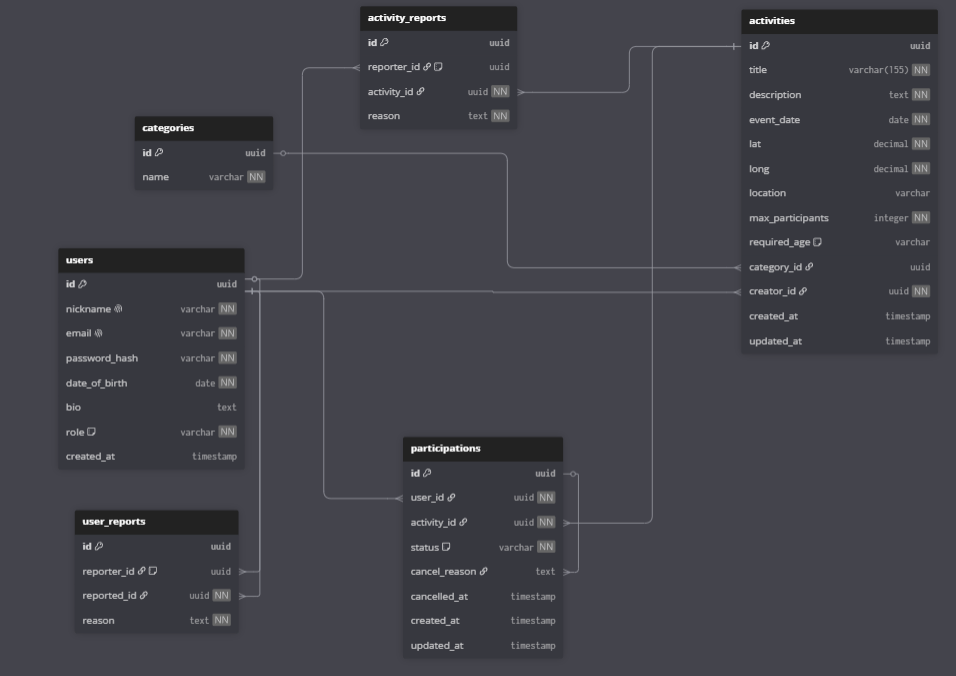

# DoTogether

**DoTogether** to aplikacja webowa umożliwiająca organizowanie i dołączanie do lokalnych aktywności społecznych. Użytkownicy mogą tworzyć wydarzenia, zapisywać się na nie, a system automatycznie zarządza listą oczekujących.

---

## Spis treści

- [Instrukcja uruchomienia](#instrukcja-uruchomienia)
- [Podręcznik użytkownika](#podręcznik-użytkownika)
- [Role i uprawnienia](#role-i-uprawnienia)
- [Model bazy danych](#model-bazy-danych)
- [Kontrolery](#kontrolery)
- [CRUD – Aktywności (panel administratora)](#crud--aktywności)

---

## Instrukcja uruchomienia

### Wymagania

- PHP >= 8.2
- Composer
- PostgreSQL
- Node.js + npm (do assetów)
- Laravel Herd lub inny lokalny serwer PHP

### Kroki

```bash
# 1. Sklonuj repozytorium
git clone <url-repozytorium>
cd DoTogether

# 2. Zainstaluj zależności PHP
composer install

# 3. Zainstaluj zależności JS
npm install

# 4. Skopiuj plik środowiskowy
cp .env.example .env

# 5. Wygeneruj klucz aplikacji
php artisan key:generate
```

### Konfiguracja bazy danych

Edytuj plik `.env` i ustaw dane połączenia z PostgreSQL:

```env
DB_CONNECTION=pgsql
DB_HOST=127.0.0.1
DB_PORT=5432
DB_DATABASE=DT_DB
DB_USERNAME=postgres
DB_PASSWORD=twoje_haslo
```

### Uruchomienie migracji i seedów

```bash
# Uruchom migracje (tworzy tabele)
php artisan migrate

# Opcjonalnie: wypełnij bazę przykładowymi danymi
php artisan db:seed
```

### Uruchomienie serwera

```bash
# Przez Laravel Herd (zalecane)
# – aplikacja dostępna automatycznie pod skonfigurowaną domeną

# Lub przez wbudowany serwer PHP
php artisan serve
```

Aplikacja domyślnie dostępna pod adresem: `http://localhost:8000`

### Konta testowe (po uruchomieniu seedów)

| E-mail | Hasło | Rola |
|--------|-------|------|
| `admin@dotogether.pl` | `password` | Administrator |
| `ania@example.pl` | `password` | Użytkownik |
| `marek@example.pl` | `password` | Użytkownik |
| `zofia@example.pl` | `password` | Użytkownik |
| `tomek@example.pl` | `password` | Użytkownik |

---

## Podręcznik użytkownika

### Użytkownik niezalogowany

Użytkownik bez konta może wyłącznie przeglądać **stronę główną** (`/`). Dostęp do listy aktywności, szczegółów wydarzeń oraz jakichkolwiek akcji wymaga zalogowania. Próba wejścia na chronione strony powoduje przekierowanie na stronę logowania.

### Rejestracja i logowanie

- **Rejestracja** (`/register`): wymagane pola — nick (unikalny), e-mail (unikalny), hasło (min. 8 znaków), data urodzenia (musi być w przeszłości).
- **Logowanie** (`/login`): e-mail + hasło.
- **Wylogowanie**: dostępne przez link w nawigacji.

### Przeglądanie aktywności

Lista aktywności (`/activities`) zawiera wszystkie przyszłe wydarzenia z możliwością filtrowania:

| Filtr | Opis |
|-------|------|
| Kategoria | Filtrowanie po kategorii wydarzenia (Sport, Kultura, itp.) |
| Data | Wyświetl aktywności w konkretnym dniu |
| Wolne miejsca | Minimalna liczba dostępnych miejsc |
| Ograniczenie wiekowe | Brak ograniczeń / Dzieci / 18+ / 40+ |
| Odległość | Promień od podanej lokalizacji (wymaga geolokalizacji) |

Domyślnie aktywności sortowane są po dacie (od najbliższej), a gdy podana jest lokalizacja — po odległości.

### Szczegóły aktywności

Strona szczegółów (`/activities/{id}`) zawiera:
- Tytuł, opis, datę, lokalizację na mapie
- Liczbę potwierdzonych uczestników i dostępnych miejsc
- Listę uczestników (CONFIRMED) i kolejkę oczekujących (WAITLISTED)
- Przycisk akcji (Dołącz / Opuść / Edytuj — zależnie od roli)

### Dołączanie do aktywności

- Zalogowany użytkownik klika **„Dołącz"** na stronie szczegółów.
- Jeśli są wolne miejsca → status `CONFIRMED`.
- Jeśli brak miejsc → status `WAITLISTED` (lista oczekujących).
- Gdy ktoś odejdzie, pierwsza osoba z listy oczekujących automatycznie otrzymuje status `CONFIRMED`.

### Opuszczanie aktywności

Uczestnik może opuścić wydarzenie podając opcjonalny powód. Status zmienia się na `CANCELLED`. System automatycznie awansuje następną osobę z listy oczekujących.

### Tworzenie aktywności

Zalogowany użytkownik może stworzyć własne wydarzenie (`/activities/create`):

- **Tytuł** — wymagany, max. 155 znaków
- **Opis** — wymagany
- **Data wydarzenia** — wymagana
- **Lokalizacja** — wybór przez mapę (interaktywny pin) lub wpisanie adresu
- **Maksymalna liczba uczestników** — wymagana, min. 1
- **Kategoria** — wybór z listy
- **Ograniczenie wiekowe** — Brak / Dzieci / 18+ / 40+

Twórca aktywności jest automatycznie dodawany jako uczestnik (status `CONFIRMED`) i ma możliwość edycji oraz usunięcia wydarzenia.

### Zarządzanie swoją aktywnością

Twórca może:
- **Edytować** tytuł, opis, datę, kategorię, ograniczenie wiekowe (`/activities/{id}/edit`)
- **Usunąć** aktywność (usuwa również wszystkich uczestników)
- **Usunąć uczestnika** z wydarzenia (status `REMOVED`) — zablokowany użytkownik nie może ponownie dołączyć

### Profil użytkownika

Panel profilu (`/profile`):
- **Mój profil** — nick, e-mail, data urodzenia, opis (bio)
- **Moje aktywności** — lista stworzonych wydarzeń
- **Moje zapisy** — lista aktywności, do których dołączono
- **Edycja profilu** (`/profile/edit`) — zmiana nicku, e-maila, daty urodzenia, opisu

### Zgłaszanie

- **Zgłoś aktywność** — dostępne na stronie szczegółów aktywności (nie dotyczy własnych)
- **Zgłoś użytkownika** — dostępne przy liście uczestników (nie dotyczy siebie)

---

## Role i uprawnienia

System rozróżnia dwie role:

| Uprawnienie | Użytkownik (`USER`) | Administrator (`ADMIN`) |
|-------------|---------------------|------------------------|
| Przeglądanie aktywności | ✅ | ✅ |
| Tworzenie aktywności | ✅ | ✅ |
| Edycja własnych aktywności | ✅ | ✅ |
| Usuwanie własnych aktywności | ✅ | ✅ |
| Dołączanie / opuszczanie | ✅ | ✅ |
| Usuwanie uczestnika ze swojej aktywności | ✅ (tylko twórca) | ✅ |
| Zgłaszanie aktywności/użytkowników | ✅ | ✅ |
| Przeglądanie zgłoszeń aktywności | ❌ | ✅ |
| Przeglądanie zgłoszeń użytkowników | ❌ | ✅ |
| Zatwierdzanie zgłoszeń (usuwanie aktywności/użytkownika) | ❌ | ✅ |
| Odrzucanie zgłoszeń | ❌ | ✅ |

### Panel administratora

Administrator ma dostęp do dodatkowych sekcji w profilu:
- `/profile/activity-reports` — lista zgłoszeń aktywności
- `/profile/user-reports` — lista zgłoszeń użytkowników

#### Zarządzanie zgłoszeniami aktywności

Każde zgłoszenie zawiera: aktywność, zgłaszającego, powód. Administrator może:
- **Usuń aktywność** (`DELETE_ACTIVITY`) — trwale usuwa wydarzenie i wszystkich uczestników
- **Odrzuć zgłoszenie** — zamyka zgłoszenie bez akcji

#### Zarządzanie zgłoszeniami użytkowników i profilami

Każde zgłoszenie zawiera: zgłaszany użytkownik, zgłaszający, powód. Administrator może:
- **Zbanuj użytkownika** — trwale usuwa konto. Wszystkie potwierdzone uczestnictwa są automatycznie anulowane, a system awansuje osoby z listy oczekujących.
- **Odrzuć zgłoszenie** — zamyka zgłoszenie bez akcji

---

## Model bazy danych



### Tabela: `users`

| Kolumna | Typ | Opis |
|---------|-----|------|
| `id` | UUID | Klucz główny |
| `nickname` | string | Unikalny nick użytkownika |
| `email` | string | Unikalny adres e-mail |
| `password_hash` | string | Hash hasła (bcrypt) |
| `date_of_birth` | date | Data urodzenia |
| `bio` | text (nullable) | Opis profilu |
| `role` | enum | `USER` lub `ADMIN` |
| `created_at` | timestamp | Data rejestracji |

### Tabela: `activities`

| Kolumna | Typ | Opis |
|---------|-----|------|
| `id` | UUID | Klucz główny |
| `title` | string | Tytuł aktywności (max 155 znaków) |
| `description` | text | Opis wydarzenia |
| `event_date` | date | Data wydarzenia |
| `lat` / `long` | decimal | Współrzędne geograficzne |
| `location` | string (nullable) | Czytelna nazwa miejsca |
| `max_participants` | integer | Maksymalna liczba uczestników |
| `required_age` | enum (nullable) | `KIDS` / `ADULTS_ONLY` / `SENIORS` |
| `category_id` | UUID (FK) | Kategoria → `categories.id` |
| `creator_id` | UUID (FK) | Twórca → `users.id` |

### Tabela: `participations`

Tabela łącząca użytkowników z aktywnościami. Relacja many-to-many z dodatkowymi atrybutami.

| Kolumna | Typ | Opis |
|---------|-----|------|
| `id` | UUID | Klucz główny |
| `user_id` | UUID (FK) | Uczestnik → `users.id` (cascade delete) |
| `activity_id` | UUID (FK) | Aktywność → `activities.id` (cascade delete) |
| `status` | enum | `CONFIRMED` / `WAITLISTED` / `CANCELLED` / `REMOVED` |
| `cancel_reason` | text (nullable) | Powód anulowania/usunięcia |
| `cancelled_at` | timestamp (nullable) | Czas anulowania |

**Statusy uczestnictwa:**
- `CONFIRMED` — uczestnik potwierdzony, zajmuje miejsce
- `WAITLISTED` — na liście oczekujących (brak wolnych miejsc)
- `CANCELLED` — użytkownik sam zrezygnował
- `REMOVED` — usunięty przez twórcę aktywności (zablokowany)

### Tabela: `categories`

| Kolumna | Typ | Opis |
|---------|-----|------|
| `id` | UUID | Klucz główny |
| `name` | string | Nazwa kategorii (np. Sport, Kultura) |

### Tabela: `user_reports`

| Kolumna | Typ | Opis |
|---------|-----|------|
| `id` | UUID | Klucz główny |
| `reporter_id` | UUID (FK, nullable) | Zgłaszający → `users.id` (null on delete) |
| `reported_id` | UUID (FK) | Zgłaszany → `users.id` (cascade delete) |
| `reason` | text | Powód zgłoszenia |

### Tabela: `activity_reports`

| Kolumna | Typ | Opis |
|---------|-----|------|
| `id` | UUID | Klucz główny |
| `reporter_id` | UUID (FK, nullable) | Zgłaszający → `users.id` (null on delete) |
| `activity_id` | UUID (FK) | Zgłaszana aktywność → `activities.id` (cascade delete) |
| `reason` | text | Powód zgłoszenia |

---

## Kontrolery

### `AuthController`

Obsługuje rejestrację, logowanie i wylogowanie.

| Metoda | Trasa | Opis |
|--------|-------|------|
| `show_login` | `GET /login` | Formularz logowania |
| `show_register` | `GET /register` | Formularz rejestracji |
| `login` | `POST /login` | Walidacja i logowanie |
| `register` | `POST /register` | Walidacja i tworzenie konta |
| `logout` | `GET /logout` | Wylogowanie |

**Walidacja rejestracji:** nick (unikalny), e-mail (unikalny), hasło (min. 8 znaków), data urodzenia (przed dzisiejszym dniem).

---

### `ActivityController`

Zarządza pełnym cyklem życia aktywności (CRUD).

| Metoda | Trasa | Opis |
|--------|-------|------|
| `index` | `GET /activities` | Lista aktywności z filtrami |
| `details` | `GET /activities/{id}` | Szczegóły aktywności |
| `create` | `GET /activities/create` | Formularz tworzenia |
| `store` | `POST /activities` | Zapis nowej aktywności |
| `edit` | `GET /activities/{id}/edit` | Formularz edycji |
| `update` | `PUT /activities/{id}` | Aktualizacja aktywności |
| `delete` | `DELETE /activities/{id}` | Usunięcie aktywności |

**Filtry w `index`:** kategoria, data, wolne miejsca, ograniczenie wiekowe, promień odległości (geolokalizacja z rozszerzeniem `earthdistance` PostgreSQL).

---

### `ParticipationController`

Zarządza uczestnictwem użytkowników w aktywnościach.

| Metoda | Trasa | Opis |
|--------|-------|------|
| `join` | `POST /activities/{id}/join` | Dołącz do aktywności |
| `leave` | `DELETE /activities/{id}/leave` | Opuść aktywność |
| `remove` | `DELETE /activities/{id}/remove/{userId}` | Usuń uczestnika (tylko twórca) |

System automatycznie przydziela status `CONFIRMED` lub `WAITLISTED` w zależności od dostępności miejsc. Obserwator `ParticipationObserver` automatycznie awansuje pierwszą osobę z `WAITLISTED` gdy zwolni się miejsce `CONFIRMED`.

---

### `UserController`

Zarządza profilem zalogowanego użytkownika.

| Metoda | Trasa | Opis |
|--------|-------|------|
| `index` | `GET /profile` | Strona profilu |
| `activities` | `GET /profile/activities` | Stworzone aktywności |
| `participations` | `GET /profile/participations` | Zapisy na aktywności |
| `edit` | `GET /profile/edit` | Formularz edycji profilu |
| `update` | `PUT /profile/edit` | Zapis zmian profilu |

**Walidacja edycji profilu:** nick (unikalny poza własnym rekordem), e-mail, data urodzenia, bio (max 1000 znaków).

---

### `ReportController`

Zarządza systemem zgłoszeń (dostępny dla wszystkich zalogowanych, panel rozwiązywania — tylko dla administratora).

| Metoda | Trasa | Opis |
|--------|-------|------|
| `report_activity` | `POST /activities/{id}/report` | Zgłoś aktywność |
| `report_user` | `POST /activities/{id}/report/{userId}` | Zgłoś użytkownika |
| `activity_reports` | `GET /profile/activity-reports` | Lista zgłoszeń aktywności (admin) |
| `user_reports` | `GET /profile/user-reports` | Lista zgłoszeń użytkowników (admin) |
| `resolve_activity_report` | `POST /report/activity/{id}/resolve` | Usuń aktywność (admin) |
| `reject_activity_report` | `POST /report/activity/{id}/reject` | Odrzuć zgłoszenie (admin) |
| `resolve_user_report` | `POST /report/user/{id}/resolve` | Zbanuj użytkownika (admin) |
| `reject_user_report` | `POST /report/user/{id}/reject` | Odrzuć zgłoszenie (admin) |

---

## CRUD – Aktywności

Aktywności (`activities`) są zasobem zależnym od kategorii (`categories`) relacją **many-to-one** (wiele aktywności może należeć do jednej kategorii).

### CREATE – Tworzenie aktywności

**Formularz** dostępny pod `/activities/create` (wymaga zalogowania).

Formularz zawiera następujące pola z walidacją:

| Pole | Typ | Walidacja serwera | Walidacja klienta |
|------|-----|--------------------|-------------------|
| Tytuł | text | required, string, max:155 | required, maxlength |
| Opis | textarea | required, string | required |
| Data wydarzenia | date | required, date | required, type=date |
| Lokalizacja | text | nullable, string | — |
| Max. uczestników | number | required, integer, min:2 | required, min=1 |
| Kategoria | select (z bazy) | nullable | — |
| Ograniczenie wiekowe | select | string | — |

Lokalizacja wybierana jest przez wpisanie, a współrzędne (lat/long) oraz adres są uzupełniane automatycznie. Twórca jest automatycznie dodawany jako uczestnik ze statusem `CONFIRMED`.

### READ – Lista aktywności

**Lista** dostępna pod `/activities` (wymaga zalogowania).

- Wyświetlane są wyłącznie **przyszłe** aktywności
- Możliwość filtrowania po: kategorii, dacie, wolnych miejscach, ograniczeniu wiekowym, odległości
- Sortowanie domyślne: po dacie (od najbliższej); gdy podano lokalizację — po odległości
- Każda karta aktywności pokazuje: tytuł, kategorię, datę, miejsce, liczbę uczestników, dostępne miejsca

### UPDATE – Edycja aktywności

**Formularz edycji** dostępny pod `/activities/{id}/edit` (tylko twórca lub admin).

Walidacja identyczna jak przy tworzeniu. Niezmienne pola: lokalizacja (lat/long), maksymalna liczba uczestników (po zapisaniu nie można zmniejszyć).

### DELETE – Usuwanie aktywności

Dostępne dla twórcy aktywności z poziomu panelu **„Moje aktywności"** (`/profile/activities`). Usunięcie aktywności kaskadowo usuwa wszystkie powiązane uczestnictwa i raporty.

Administrator może usunąć aktywność przez panel zgłoszeń: `POST /report/activity/{id}/resolve` z parametrem `action=DELETE_ACTIVITY`.

### Dostęp użytkownika niezalogowanego

| Zasób | Niezalogowany | Zalogowany |
|-------|---------------|------------|
| Strona główna `/` | ✅ Pełny dostęp | ✅ |
| Lista aktywności `/activities` | ❌ Przekierowanie do logowania | ✅ |
| Szczegóły aktywności `/activities/{id}` | ❌ Przekierowanie do logowania | ✅ |
| Tworzenie aktywności | ❌ | ✅ |
| Edycja / usuwanie | ❌ | ✅ (tylko właściciel) |
| Dołączanie / opuszczanie | ❌ | ✅ |
| Panel profilu | ❌ | ✅ |
| Panel administratora | ❌ | ✅ (tylko ADMIN) |
